<div align="center">
<h1 align="center">

<br>CRM-API</h1>
<h3>◦ Simplified customer interactions. Close more deals.</h3>
<h3>◦ Developed with the software and tools below.</h3>
    

<p align="center">


</p>


</div>

---

## 📖 Table of Contents
- [📖 Table of Contents](#-table-of-contents)
- [📍 Overview](#-overview)
- [📦 Features](#-features)
- [🚀 Getting Started](#-getting-started)
    - [🔧 Architecture](#architecture)
    - [🔧 Installation](#-installation)
    - [🤖 Running the Application](#-running-the-application)
    - [🧪 Tests](#-tests)
- [📂 Repository Structure](#-repository-structure)
- [🤝 Contributing](#-contributing)
- [📄 License](#-license)

## 📍 Overview

The CRM API is a production-ready Spring Boot 3 project using Spring WebMVC.
It's designed for scalable CRUD operations on customers and OAuth 2.0 users.

## 📦 Features

- Java 21 LTS
- Maven
- Spring Boot 3 with Spring 6
- Spring Data JPA
- Docker Compose With PostgreSQL for Local Development
- Automated Unit Tests
- VCS on Github
- Spring Actuator
- Spring Cloud Gateway
- Spring WebMVC
- Contract-First Swagger CodeGen with OpenAPI 3 Standard
- Github Actions CI with "Build Pass" Badge
- CI/CD on AWS ECS with Docker
- Paketo Buildpack
- Spring Profiles
- Readme
---

## 🚀 Getting Started

## 🔨 Architecture

The CRM API is a microservices architecture with three services: Gateway, User, and Customer. Each service is a Spring Boot application with its own responsibilities.
Each Spring Boot Application is built with Maven and uses Spring WebMVC for RESTful API endpoints.

The Gateway service is the entry point for all requests. It routes requests to the appropriate service based on the URL path.

## C4 Level Diagram 1 - Context
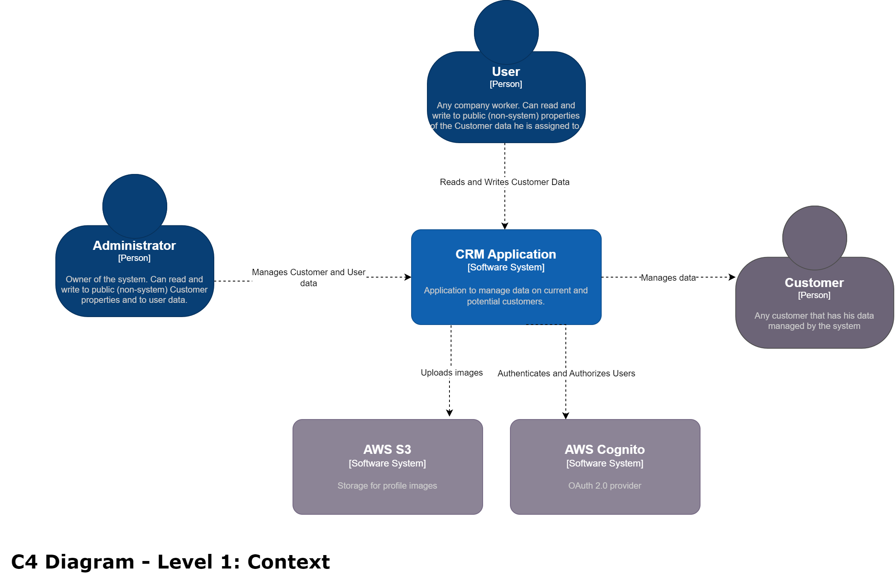
## C4 Level Diagram 2 - Container
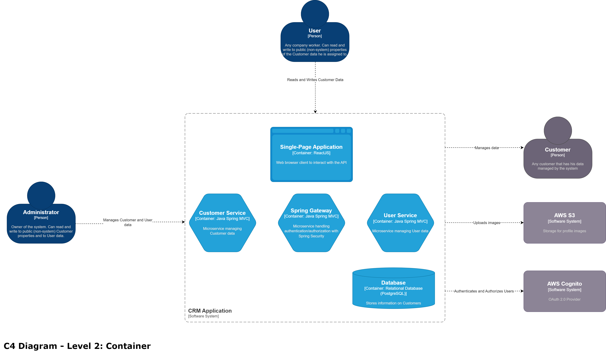

### Contract-first Code Generation with OpenAPI 3

The API is designed with the OpenAPI 3 standard. This is the current best practice for designing RESTful APIs and if done 
before development starts, permits the frontend and backend teams to work simultaneous on each side of the contract in a 
clearly defined manner. This also ensures that the API is well documented and portable, as it can be used to generate clients
and server in many different programming languages.

The API is defined in the openapi.yaml specification file in the resources of each module. When the generate-sources goal
is called or the maven module is recompiled, the specification is read by the openapi-generator-maven-plugin and classes 
defined through the specification, DTOs and web layer classes, are generated in the target folder. These can then be used 
regularly by the code base. On any change, the specification can be updated and the code regenerated. This ensures an always 
updated API contract.

The API endpoints are also versioned for easy maintenance and updates.

### Vertical Slice Architecture

This project follows a Vertical Slice Architecture approach, where the focus is on organizing the code by feature rather than by layer. 
Each feature, such as handling customers or users, encapsulates its own domain logic, commands, queries, and controllers. 
This means that all the relevant code for a single feature, including data access, business logic, and API endpoints, 
resides within a single vertical slice.
By structuring the code in this way, each slice is isolated, promoting a cleaner separation of concerns. It becomes 
easier to work on individual features without affecting others, which enhances maintainability, scalability, and testability.
For example, the customer-related commands and queries, such as creating, updating, and deleting customers, are bundled 
together with their respective service, repository, and DTOs. This approach keeps everything needed for a specific 
functionality in one place, making the development process more efficient.

### CQRS

The project also follows the Command Query Responsibility Segregation (CQRS) pattern. CQRS separates the operations that 
mutate data (commands) from those that query data (queries). This improves scalability and performance by allowing each side to 
scale independently based on its needs.
In the customer service, the application uses dedicated handlers for commands like CreateCustomerHandler or UpdateCustomerHandler, 
and separate handlers for queries like ListCustomersHandler or GetCustomerByIdHandler. This separation enables optimized 
handling of complex business logic for updates, while providing faster, simplified query operations.
CQRS, in combination with the vertical slice architecture, ensures that the code is both clean and easy to extend. 
Each command and query is independent and encapsulated, making the addition of new features or modifications to 
existing ones straightforward without introducing side effects.

### Dependency Management

This project uses a parent pom dependency to manage the versions of common dependencies. This ensures that all services
use the same version of dependencies and that the versions are updated in a single place. This also ensures that the project
is easily maintainable and that the versions are always up to date and compatible between each other.

### Logging

The applications use the SLF4J logging facade with Logback as the implementation. Spring automatically included logs for 
many autoconfigured dependencies and classes, but, to complement this feature, the applications also log custom messages 
automatically in the business features/ path by means of the LoggingAspect class. Entries and exists with arguments and returns 
of each method are automatically logged to the console.

### Error Handling

A custom ErrorMessage object is returned when predefined exceptions are thrown. This object contains a message, and status code,
and a timestamp. Any exception that is not predefined is caught by the GlobalExceptionHandler ControllerAdvice class and 
a generic error message is returned with a 500 status code.

### Security

The applications are secured with Spring Security authentication and authorization with a OAuth 2.0 provider, in this case AWS Cognito. Only
 admins may provide access to new users to the application or create new admins. The gateway service centralizes authentication 
and is responsible for calling the AWS Cognito hosted UI which is used for user authentication. The choice for AWS Cognito 
Hosted UI is due to offloading the maintenance and security vulnerabilities to AWS, while still providing a secure and
customizable channel.
- The user service can only be accessed by admins.
- The customer service can be accessed by any authenticated user.
- Health endpoints are public for all three endpoints.

Authentication is managed centrally by Spring Cloud Gateway, while authorization is managed by the services themselves through
the use of Spring Security and the Cognito issuer, acting as resource servers.

### Storage

The customer service uses a PostgreSQL database for saving and retrieving customer data. For saving and retrieving profile images,
the customer service uses a file storage provider, which is currently AWS S3. The images do not go directly through the API service, to 
preserve bandwidth and reduce latency.

## Database

The script for initializing the table in the database is available in the customer module in the resources folder. Our customers
have available the following properties:

- id
- name
- surname
- customer_id
- created_by
- updated_by
- created_at
- updated_at
- created_by
- updated_by

### AWS

#### Compute

The services are deployed on AWS Elastic Container Service (ECS) with Fargate. This allows for easy scaling and 
management of the underlying capacity.

#### Storage

An PostgreSQL instance is deployed on AWS RDS, with automatic snapshots and updates, which houses the customer table.
An S3 bucket is used to store profile images, with automatic encryption and versioning. All images are uploaded with pre-
signed urls with write capabilities, available for 15 minutes after creating the user or calling the update method with changePhoto
set to true. Similarly, the image is only available for 15 minutes after calling one of the query endpoints.
The Docker images are deployed on AWS Elastic Container Registry (ECR), which is a fully managed private 
Docker container registry.

#### Networking

The services are available through an external Application Load Balancer which automatically performs service discovery with health checks
for the ECS container tasks through target groups.

This load balancer is directly connected to the network interface created by each container task.

#### Cognito

The services use AWS Cognito for user authentication. The user pool is created with the necessary attributes and the hosted
UI is used for user authentication. The user pool is connected to the gateway service, which is responsible for calling the 
authentication front end endpoint.

The only available group is admins. Every user in the pool is considered a regular user and has access to the customer service.
Only users in the admins group may access the user service.

### CI/CD

For integration and deployment, the project follows a trunk-based approach were new branches are created according to the
Conventional Commits and feature/fix/bugfix/hotfix paradigm. When a new feature is developed, it is merged back into main 
by means of a pull request. When the pull request is closed, the pipeline begins.

The pipeline is a GitHub Actions workflow that builds the project, runs the tests, and deploys the application to AWS ECS.
It uses the Spring Boot build-image extension and Paketo Buildpack to create a Docker image and push it to the AWS Elastic Container Registry.
The deployment is done using the AWS ECS service.

The steps are:

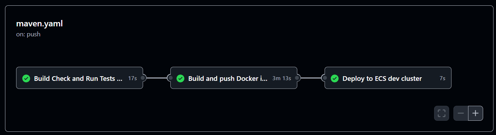

- The developer creates a new branch and pushes it to the repository.
- The developer creates a pull request.
- The pipeline is triggered.
- The pipeline builds the parent pom with maven.
- The pipeline builds the services with maven, executing unit tests.
- The pipeline builds a Docker image for each service, with Paketo buildpacks and the mvn spring-boot:build-image command.
- The pipeline pushes the Docker images to the AWS Elastic Container Registry (ECR).
- The pipeline pushes a new service update on AWS Elastic Container Service (ECS), which pulls images from ECR.
- The services are automatically deployed with the new version or rollback if the deployment fails.

## 🔧 Installation

### Requirements

- Java JDK 21 or higher
- Maven 3.6.3 or higher

### Clone the Repository

```bash
git clone https://github.com/arthurraposodev/crm-api
```

### Build the Project

To build the project, we will need to first build and install the parent pom dependency, which controls the versions 
of many common dependencies. This is done by running the following command in the root directory of the project:

```bash
mvn clean install
```

With that, our parent dependency will be installed in the local maven repository.

## 🤖 Running the Application

Please set the following environment variables according to the service. Please ask a team member for these sensitive values:

### Gateway

- ISSUER_URI: The URI of the OAuth 2.0 issuer.
- SERVER_URI: The URI of the server.
- COGNITO_USER_POOL: The Cognito user pool ID.

### User Service
- AWS_ACCESS_KEY_ID: The AWS access key ID.
- AWS_SECRET_ACCESS_KEY: The AWS secret access key.
- ISSUER_URI: The URI of the OAuth 2.0 issuer.
- COGNITO_USER_POOL: The Cognito user pool ID.

### Customer Service
- AWS_ACCESS_KEY_ID: The AWS access key ID.
- AWS_SECRET_ACCESS_KEY: The AWS secret access key.
- ISSUER_URI: The URI of the OAuth 2.0 issuer.
- DATABASE_PASSWORD: The database password. Only necessary in prod profile.
- DATABASE_URL: The database URL. Only necessary in prod profile.
- DATABASE_USERNAME: The database username. Only necessary in prod profile.
- AWS_BUCKET_NAME: The AWS bucket name.


To run each application locally (non-volatile docker compose PostgreSQL database automatically created):
### Gateway
```bash
cd gateway
mvn spring-boot:run
```
### User Service
```bash
cd user
mvn spring-boot:run
```
### Customer Service
```bash
cd customer
mvn spring-boot:run
```

After each application has started up, the REST endpoints are exposed through the gateway on port 8080 according to the OpenAPI 3 standard.

In prod, the spring profile is set to prod before running the application (SPRING_PROFILES_ACTIVE=prod). This ensures 
that the development local database does not spin up (docker compose up is not called).

### Example Postman Collection

A Postman collection with all available endpoints is available in the project, inside the example folder. Link:
[Postman Collection](example/postman_collection.json)

## Authentication

The API uses OAuth 2.0 for user authentication. To access the endpoints you must have a user account created by an admin
and client credentials to access the API.

Currently, the only client approved for authentication is Postman.

### How to use Postman for OAuth 2.0

1. Open the Postman Collection and choose an endpoint.
2. Navigate to the Authorization tab.
3. Choose OAuth 2.0 from the dropdown.
4. Scroll down to Configure New Token.
5. Fill in the following fields (ask the development team for these details):
    - Token Name: Any
    - Grant Type: Authorization Code
    - Authorize Using Browser
    - Auth URL
    - Access Token URL
    - Client ID
    - Client Secret
6. Click Get New Access Token.
7. A new window will open in your browser. Log in with your user credentials.
8. After logging in, you will be redirected to postman (approve pop up and redirect) with a code.
9. Postman should auto exchange the authorization code for a usable access token.
10. Select the token from the dropdown whenever you want to make a request.

## Screenshots

### Creating a new User

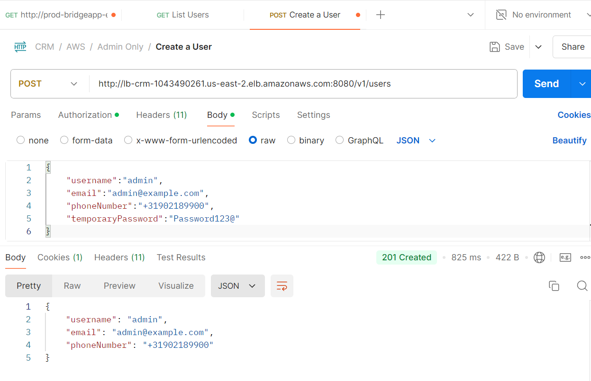

### Make User an Admin

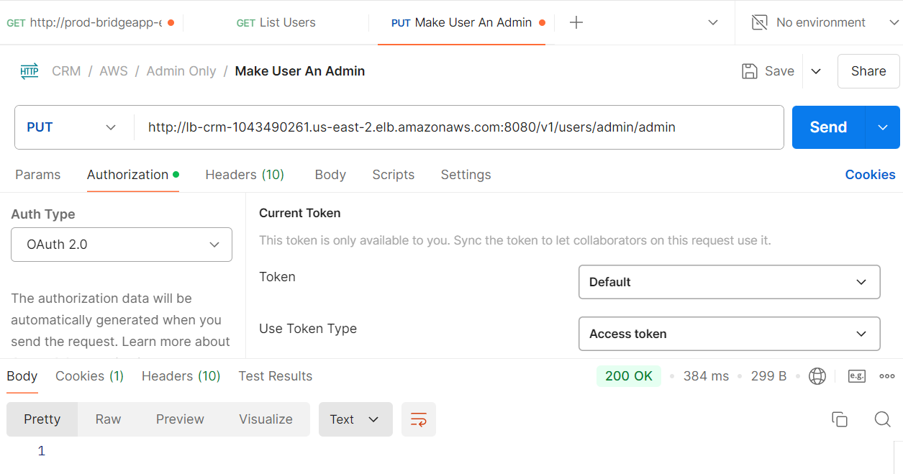

### Getting all Users

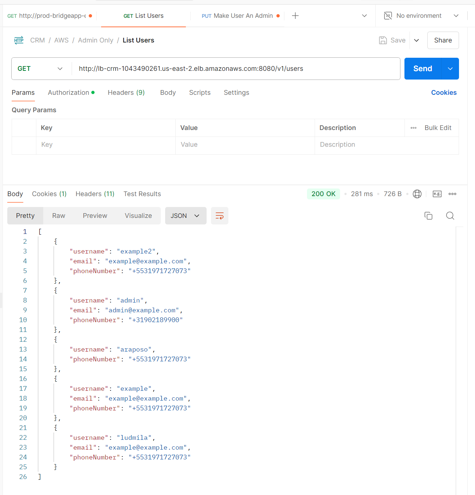

### Creating a new Customer

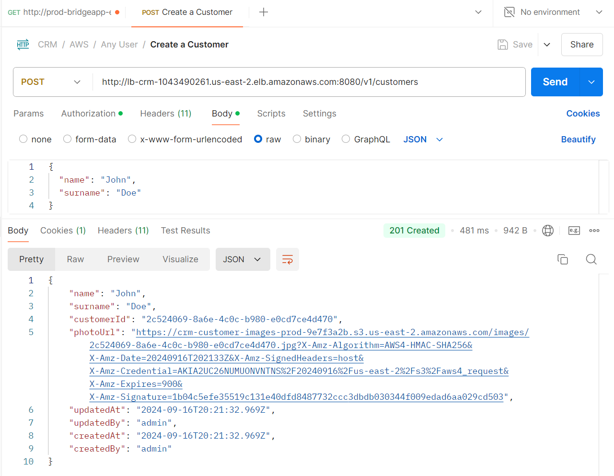

### Uploading Photo to S3

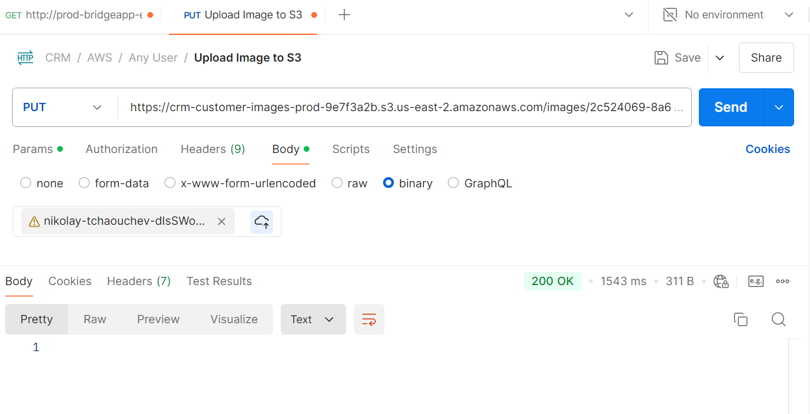

### Getting all Customers

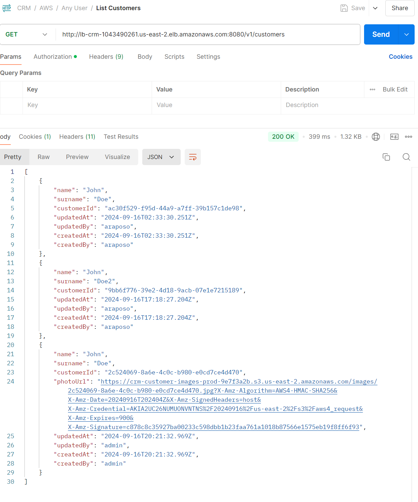

### Accessing Url of Image from Getting All Customer's Last Entry (Only Available for 15 Minutes - Presigned)


## 📂 Repository Structure

```sh
└── com.am.crm.gateway/
    ├── security/: Security-related configurations.
```
```sh
└── com.am.crm.customer/
    ├── config/: Configuration files for the application.
    ├── domain/: Domain models and entities.
    ├── exception/: Custom exceptions and error handling logic.
    ├── features/: Application features (CQRS command/query handlers).
    ├── infrastructure/: Infrastructure related files (repository, external services).
    ├── log/: Logging configuration or aspect logic.
    ├── security/: Security-related configurations.
    ├── util/: Utility classes for general-purpose functionality.
    ├── web/: API layer (api delegate, dto mappers).
```
```sh
└── com.am.crm.user/
    ├── config/: Configuration files for the application.
    ├── exception/: Custom exceptions and error handling logic.
    ├── features/: Application features (CQRS command/query handlers).
    ├── infrastructure/: Infrastructure related files (repository, external services).
    ├── log/: Logging configuration or aspect logic.
    ├── security/: Security-related configurations.
    ├── web/: API layer (api delegate, dto mappers).
```
---
## 🧪 Tests
Test folders follow the same structure as source folders. This project respects an 80% code coverage target (excluding generated classes).
```bash
cd gateway
```
### Gateway
```bash
cd gateway
mvn test
```
### User Service
```bash
cd user
mvn test
```
### Customer Service
```bash
cd customer
mvn test
```

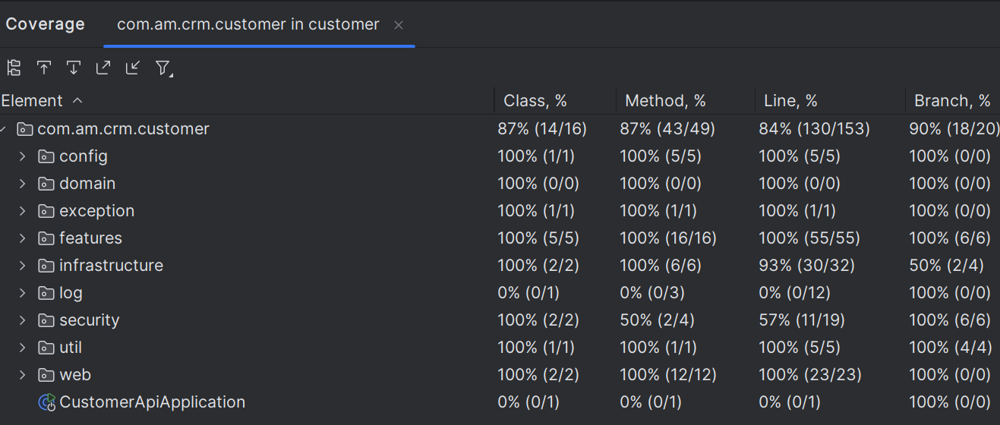
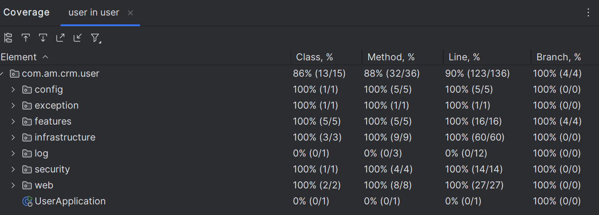
---

## 🤝 Contributing
Contributions are welcome! Please follow these steps:

- **[Submit Pull Requests](https://github.com/arthurraposodev/crm-api/blob/main/CONTRIBUTING.md)**: Review open PRs, and submit your own PRs.
- **[Join the Discussions](https://github.com/arthurraposodev/crm-api/discussions)**: Share your insights, provide feedback, or ask questions.
- **[Report Issues](https://github.com/arthurraposodev/crm-api/issues)**: Submit bugs found or log feature requests for arthurraposodev.

## 📄 License
```bash
This project is licensed under the MIT License - see the LICENSE.md file for details.
```
